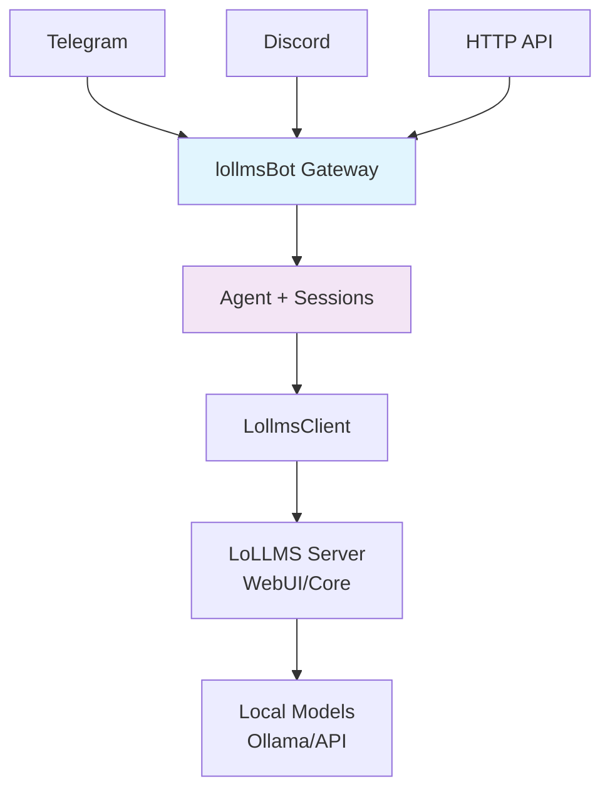

# lollmsBot
[](https://www.apache.org/licenses/LICENSE-2.0)
[](https://www.python.org/downloads/)
[](https://hub.docker.com/r/parisneo/lollmsbot)
[](https://lollms.com)
> **Agentic LoLLMS-powered personal AI assistant**  
> _Clawdbot architecture -  Self-hostable -  Multi-platform -  Production-ready_

<p align="center">
  
  
  
  
</p>

## ✨ Features

| ✅ **Done** | ⏳ **Next** | 🔮 **Planned** |
|------------|-------------|----------------|
| LoLLMS API + Bindings | Telegram Channel | Discord/Slack |
| FastAPI Gateway | Agent Sessions | File System Tools |
| `.env` Config | Memory Store | Calendar Integration |
| Cross-platform | Tool Framework | Browser Automation |
| Auto Python/Venv | WebSocket | Scheduled Tasks |
| Docker + Compose | Multi-user | Mobile Clients |

## 🚀 Quick Start

### Native Install
```bash
# Windows
install.bat
.venv\Scripts\activate.bat
lollmsbot gateway

# Linux/macOS/Pi
./install.sh
source .venv/bin/activate
lollmsbot gateway
```

### Docker (Recommended)
```bash
git clone https://github.com/ParisNeo/lollmsBot
cd lollmsBot
cp .env.example .env  # Edit LOLLMS_HOST_ADDRESS
docker-compose up -d
```

**Test endpoints:**
```
GET  http://localhost:8800/health
POST http://localhost:8800/chat  # {"message": "Hello!"}
```

## 🐳 Docker

### Single Container
```bash
docker run -p 8800:8800 \
  -v $(pwd)/.env:/app/.env \
  -v lollmsbot-data:/app/data \
  ghcr.io/parisneo/lollmsbot:latest
```

### Full Stack (lollmsBot + LoLLMS)
```bash
docker-compose up -d
# lollmsBot: http://localhost:8800
# LoLLMS UI:  http://localhost:9642
```

## ⚙️ Configuration

**.env** (create this file):
```env
# LoLLMS Backend
LOLLMS_HOST_ADDRESS=http://localhost:9642
LOLLMS_API_KEY=                        # Optional
LOLLMS_VERIFY_SSL=true
LOLLMS_BINDING_NAME=                   # ollama, openai, etc.

# lollmsBot Gateway
LOLLMSBOT_HOST=0.0.0.0
LOLLMSBOT_PORT=8800
```

## 🛠 Architecture



## 📱 Supported Platforms

| Platform | 🖥️ Native | 🐳 Docker |
|----------|-----------|-----------|
| **Windows** | ✅ CMD/PS | ✅ |
| **Linux** | ✅ Ubuntu/Fedora | ✅ |
| **macOS** | ✅ Homebrew | ✅ |
| **Raspberry Pi** | ✅ Pi OS (ARM) | ✅ Multi-arch |
| **Docker Desktop** | - | ✅ |

## 💻 API Endpoints

```bash
# Health check
curl http://localhost:8800/health

# Simple chat (v0.1)
curl -X POST http://localhost:8800/chat \
  -H "Content-Type: application/json" \
  -d '{"message": "What can you do?"}'
```

## 🔧 Development

```bash
# Clone + dev setup
git clone https://github.com/ParisNeo/lollmsBot
cd lollmsBot
./install.sh  # or install.bat
pip install -e .[dev]

# Run with hot reload
lollmsbot gateway --host 127.0.0.1 --port 8800
```

## 🛠️ Build Status


## 🤝 Contributing

1. **Fork** → **Clone** → **Branch**
2. `./install.sh` → **Test**
3. **PR** with tests

See [CONTRIBUTING.md](CONTRIBUTING.md)

## 📄 License

```
Copyright 2026 ParisNeo

Licensed under the Apache License, Version 2.0 (the "License");
you may not use this file except in compliance with the License.
```

## 🙌 Acknowledgments

- [LoLLMS](https://lollms.com) - Core AI backend
- [Clawdbot](https://clawd.bot) - Architecture inspiration
- [FastAPI](https://fastapi.tiangolo.com) - Gateway framework

***

**⭐ [Star on GitHub](https://github.com/ParisNeo/lollmsBot) -  [Issues](https://github.com/ParisNeo/lollmsBot/issues) -  [Discord](https://discord.gg/lollms)**

<div align="center">
  <sub>Made with ❤️ by <a href="https://github.com/ParisNeo">ParisNeo</a></sub>
</div>

***

